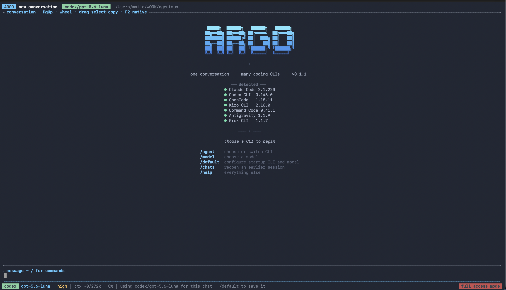

<div align="center">

# Argo

### One conversation. Many coding CLIs.

Switch coding agents without losing the thread. Argo keeps the conversation,
workspace context, tools, and child-agent lineage while each CLI does what it
does best.

[](https://github.com/MaticAlgos/argo/actions/workflows/ci.yml)
[](https://www.rust-lang.org/)
[](#installation)
[](LICENSE)

[Install](#installation) · [How it works](#how-context-is-managed) ·
[Shortcuts](#keyboard-and-mouse) · [Commands](#in-chat-commands) ·
[Usage guide](docs/usage.md) · [Contributing](CONTRIBUTING.md)

</div>



<table>
  <tr align="center">
    <td width="14%"></td>
    <td width="14%"><picture><source media="(prefers-color-scheme: dark)" srcset="docs/assets/agents/codex-dark.svg"></picture></td>
    <td width="14%"><picture><source media="(prefers-color-scheme: dark)" srcset="docs/assets/agents/opencode-dark.svg"></picture></td>
    <td width="14%"></td>
    <td width="14%"><picture><source media="(prefers-color-scheme: dark)" srcset="docs/assets/agents/command-code-dark.svg"></picture></td>
    <td width="14%"></td>
    <td width="14%"><picture><source media="(prefers-color-scheme: dark)" srcset="docs/assets/agents/grok-dark.png"></picture></td>
  </tr>
  <tr align="center">
    <td>Claude Code</td><td>Codex CLI</td><td>OpenCode</td><td>Kiro CLI</td>
    <td>Command Code</td><td>Antigravity</td><td>Grok CLI</td>
  </tr>
</table>

<sub>Agent marks identify compatible products; their owners retain all rights.
Sources and attribution are in <a href="docs/assets/README.md">docs/assets</a>.</sub>

## What Argo does

- Keeps one durable SQLite conversation across all supported coding CLIs.
- Shows the exact active CLI, model, effort, and execution mode in the TUI.
- Discovers live models where a CLI exposes them and uses verified presets where
  it does not.
- Offers reasoning effort only for the selected models that support it. For
  example, Antigravity exposes effort for adjustable Claude models, not for
  Gemini/GPT model IDs whose level is already part of the model choice. Kiro's
  verified `low`, `medium`, `high`, `xhigh`, and `max` levels are supported.
- Owns a portable Plan mode for every CLI. Shift+Tab changes Argo's conversation
  mode and prompt boundary; verified native plan controls are mirrored as an
  additional enforcement layer.
- Streams responses, CLI-emitted thinking, tools, file changes, plans, usage,
  and delegated-agent activity without inventing hidden reasoning.
- Separates user prompts from agent responses with a quiet full-width prompt
  surface and preserves Markdown list hierarchy when narrow terminals wrap it.
- Lets you show or hide thinking and tool activity together with `/thinking` or
  `Ctrl+T`, including while a model is running.
- Recognizes deliberate numbered choices and presents a keyboard picker.
- Keeps mouse-wheel scrolling and drag-to-select/copy active at the same time.
- Discovers project and global skills for every compatible agent, while keeping
  protected staged copies in Argo's user-level cache instead of each project.
- Refreshes a staged skill whenever its instructions, scripts, references, or
  assets change, and repairs cache copies modified by an earlier agent run.
- Delegates work to another CLI while preserving parent/child lineage.
- Updates the conversation title to the current request and keeps a short
  description of the conversation's starting point and current focus.
- Queues messages submitted during a run in the TUI and starts them in FIFO
  order after success or cancellation; a failure pauses the queue for review.
- Shows how long the running turn has taken beside the spinner, and reports the
  total when it finishes, including when it fails or is cancelled.

## Installation

Argo supports macOS and Linux and builds with Rust 1.82 or newer. The installer
uses a locked release build, needs no `sudo`, and installs to `~/.local/bin`:

```bash
curl -fsSL https://raw.githubusercontent.com/MaticAlgos/argo/main/install.sh | bash
```

Inspect the script first, pin a tag or commit, install from a Git clone, update,
or uninstall using the [complete installation guide](docs/installation.md).
Argo does not install or authenticate vendor CLIs for you.

Existing installations can check and update themselves without copying the
installer command again:

```bash
argo update --check
argo update
```

Uninstall the active Argo executable while preserving conversations and
configuration:

```bash
argo --uninstall
```

```bash
cd /path/to/project
argo doctor
argo
```

## Start screen and defaults

With no saved default, Argo opens its CLI picker over the welcome screen. Pick a
CLI, then a model, then an effort level only when that exact model supports one.
Each CLI row shows only its friendly name and the version detected from that
user's installed binary. These short version checks run concurrently; model
counts and delegation internals are intentionally left for the later selection
and diagnostic screens.

- `Enter` chooses the highlighted CLI for this conversation.
- `Space` chooses it and saves the completed CLI + model + optional effort as the
  startup default.
- Typing filters any picker; `↑` and `↓` move the selection.
- A saved default appears directly under the Argo logo. Start typing immediately,
  use `/agent` to change it for the current chat, or `/default` to reconfigure it.
- `/default current` saves the current exact selection; `/default clear` restores
  the startup picker.
- `/agents` opens the complete CLI inventory. `Enter` switches to a detected CLI,
  `Space` configures it as the exact CLI/model/effort default, and `Delete` clears
  the saved default.
- If a saved default CLI is later uninstalled or disappears from `PATH`, Argo
  clears that stale preference and reopens the CLI picker instead of failing or
  silently choosing another agent.

Argo always displays the effective CLI and model. It never silently substitutes
a different agent or applies an effort value to an incompatible model.

## Keyboard and mouse

| Shortcut | Action |
|---|---|
| `Enter` | Send a message or choose the highlighted item |
| `Shift+Enter` | Insert a new line; includes an Apple Terminal modifier fallback |
| `Alt+Enter` / `Ctrl+J` | Portable alternate newline shortcuts |
| `Shift+Tab` | Cycle modes supported by the selected CLI (`full` → `plan` first where supported) |
| `Tab` | Accept the highlighted slash-command completion |
| `↑` / `↓` | Move in a picker/completion list, or navigate composer history |
| `Ctrl+P` / `Ctrl+N` | Navigate composer history explicitly |
| `Option+Backspace` / `Ctrl+W` | Delete the previous word |
| `Cmd+Backspace` / `Ctrl+U` | Delete to the start of the line |
| `Option+←` / `Option+→` | Move the caret one word at a time (`Ctrl+←`/`Ctrl+→` and `Alt+B`/`Alt+F` also work) |
| `Cmd+←` / `Cmd+→` | Move the caret to the start or end of the current line |
| `Ctrl+Y` | Restore the last composer edit |
| `Ctrl+T` | Show or collapse CLI-emitted thinking and tool activity, including during a run |
| Mouse wheel / `PageUp` / `PageDown` | Scroll rendered transcript rows |
| Drag with the left mouse button | Select visible text and copy it on release |
| `Cmd+C` / `Ctrl+Shift+C` | Copy the selection, or the latest response if none is selected |
| `F2` | Toggle Argo wheel + drag mode and terminal-native selection mode |
| `Home` / `End` | Move within input; with empty input, jump through the transcript |
| `Esc` | Close an overlay; cancel a turn (then continue queued follow-ups); cancel Telegram linking; or discard a paused queue |
| `Ctrl+C`, twice within 3 seconds | Exit Argo; the first press only warns |
| `Ctrl+D` with an empty composer | Exit immediately |

Paste uses the terminal's normal shortcut (`Cmd+V` on macOS or usually
`Ctrl+Shift+V` on Linux). Bracketed paste preserves multiline text and works in
MCP token/header input. Safe rendered HTTP(S) links use terminal-native links;
Apple Terminal also supports clicking the exact displayed URL in Argo mouse mode.

While an agent is active, the status area rotates useful shortcut tips. See the
[full interaction guide](docs/usage.md#keyboard-and-mouse-reference) for terminal
details and queue behavior.

## In-chat commands

| Command | Purpose |
|---|---|
| `/agent [id]` | Choose or switch CLI for the next turn |
| `/model [id]` | Choose a model from the selected CLI's inventory |
| `/effort [level]` | Set effort only when the current model supports it |
| `/default [configure\|current\|clear]` | Manage the startup CLI/model/effort |
| `/mode [id]` | Set Argo's execution mode directly; Plan works with every CLI and `Shift+Tab` cycles it |
| `/backup [id [model]\|none]` | Configure or clear a standby CLI for quota-exhaustion failover |
| `/telegram [status|setup|allow|remove]` | Set up, inspect, or remove Telegram phone access |
| `/thinking [show\|hide\|toggle]` | Control visibility of CLI-emitted thinking and tool activity (`Ctrl+T`) |
| `/usage` | Show last-turn tokens and the selected provider's local allowance surface |
| `/status` | Show conversation, selection, context, run state with elapsed time, and queue state |
| `/update [check\|install\|force]` | Check for updates or exit and update Argo directly |
| `/agents` | Browse CLIs; Enter switches, Space configures default, Delete clears it |
| `/skills` | Show skills available to every agent |
| `/instructions [enable\|disable\|edit]` | Manage opt-in `.argo-instructions.md` project memory |
| `/context` | Preview exactly what the next CLI receives |
| `/compact` | Fold the conversation so far into a summary to free context |
| `/resume [n\|id]` | List or reopen conversations (`/open` is an alias) |
| `/new [title]` | Start a new conversation |
| `/clear-history` | Delete stored chats for this workspace and start fresh |
| `/children` | Inspect delegated conversations in a snapshot overlay |
| `/parent` or `/back` | Return from an opened child conversation |
| `/delegate <agent> <task>` | Run a self-contained task in a child conversation |
| `/mcp ...` | Add, list, check, auth, reconnect, or delete MCP servers |
| `/queue` | Review queued follow-ups; `Del` or `Ctrl+D` removes the highlighted one |
| `/cancel` | Stop the active turn; the next queued follow-up starts automatically |
| `/config` | Show preferences and state paths |
| `/doctor` | Run environment and adapter diagnostics |
| `/help` | Open the complete in-app command reference |
| `/quit` | Leave the TUI while the daemon and active agents continue |

Opening a result from `/children` is non-blocking: `Esc` or `Enter` closes the
snapshot and returns to the parent while agents continue working. Opening a real
child chat with `/open <id>` lets you use `/parent` to navigate back.

## Backup failover and Telegram access

`/backup` chooses a standby CLI, its model, and optional effort. If the active
CLI reports that its plan is exhausted before producing output or side effects,
Argo visibly continues the same run on the standby. The standby becomes the
conversation's active CLI, the exhausted CLI moves into the backup slot, and
subsequent status and usage attribution name the CLI that actually answered.
Use `/backup none` to disable failover.

Bare `/telegram` shows status when linked and otherwise opens guided setup. The
wizard validates a BotFather token, shows a bot link, then opens a 90-second
window and authorizes the sender of the first private message to arrive in it —
tapping *Start* in Telegram is enough, and nothing needs to be typed. The TUI
remains responsive while it waits; `Esc` cancels. Linking starts the bridge
immediately, so no Argo restart is required. `/telegram allow` adds the current
workspace and `/telegram remove` stops the bridge and deletes the stored token
and Telegram configuration.

**Security warning:** Telegram is remote access to coding agents. An authorized
Telegram user can select full-access mode and run commands or modify files in
every allowlisted workspace with the permissions of your local account.

Because linking authorizes whoever messages first, **the 90-second window is the
security boundary**: open it only when you are ready to message the bot yourself,
and use a freshly created bot whose username nobody else knows. Argo narrows the
window as far as it can — the claim is time-boxed, it ignores group chats, and it
only counts traffic arriving after the window opens, so a message already queued
cannot take it. If the wrong account claims the link, run `/telegram remove` and
set up again. Otherwise: authorize only trusted user IDs, keep the workspace
allowlist minimal, and remove the setup immediately if the bot token or account
is compromised.

The scriptable equivalents include:

```bash
argo telegram setup --root /path/to/project
argo telegram status
argo telegram setup --token-file /secure/path/token   # unattended
argo telegram allow <USER_ID> --root /path/to/project
argo telegram qr
argo telegram remove
```

Turn timeouts are opt-in. `ARGO_TURN_TIMEOUT_MS` limits daemon-owned agent turns;
unset, invalid, or `0` means no daemon turn deadline. Scriptable streaming also
accepts `ARGO_STREAM_IDLE_TIMEOUT_MS`; unset, invalid, or `0` waits indefinitely,
while a positive value stops that client after that many milliseconds without an
event but leaves the daemon-owned turn running. Telegram linking has its own
window — 90 seconds in the TUI, or the duration `argo telegram setup` announces —
independent of those environment variables.

## Usage reporting

`/usage` separates two different measurements:

1. Exact per-turn token fields emitted by the most recently completed CLI turn.
2. Provider allowance or local history obtained from a non-inference CLI surface.

| CLI | Provider/local surface used by Argo |
|---|---|
| Codex | local app-server rate-limit endpoint |
| Claude Code | local `/usage` command |
| Kiro CLI | `kiro-cli chat --no-interactive /usage` |
| Command Code | interactive local `/usage` panel |
| Antigravity | interactive local `/usage` panel |
| OpenCode | `opencode stats` local history; not presented as remaining quota |
| Grok CLI | local historical totals only; no verified remaining-quota command |

Unavailable values remain unavailable; Argo does not estimate billing balance or
invent a quota from context-window usage.

## MCP management

Use `/mcp add` for guided setup from the TUI. It covers local stdio servers,
remote HTTP servers, imports, OAuth, bearer tokens, and custom headers. Tokens
can be pasted. During OAuth, Argo opens the browser when possible and always
shows the authorization URL so it can be copied manually.

```text
/mcp list
/mcp check [name]
/mcp add
/mcp reconnect <name>
/mcp login <name>        # /mcp reauth is an alias
/mcp logout <name>
/mcp remove <name>       # /mcp delete is an alias
```

Existing non-Argo vendor configuration is preserved. Argo can project MCP
servers through generated Claude configuration, non-persistent native Codex
config overrides, Kiro ACP descriptors, and the supported shared configuration
formats for OpenCode, Command Code, and Antigravity. Grok currently has no
verified MCP injection mechanism. `/mcp list` always shows the built-in `argo`
delegation server separately from servers you added.

## Delegation and child agents

Ordinary subagent work stays inside the CLI currently running the conversation.
Argo tells that CLI to use its native subagent mechanism when one is available.
The `argo_delegate` MCP tool is reserved for explicit cross-CLI requests: Argo
does not initiate cross-CLI work merely for exploration, parallelism, or a second
opinion.

Claude, Codex, and Kiro can receive Argo's native delegation tools through MCP.
Other compatible hosts can use the daemon-backed command supplied in their turn
environment. Each delegated task gets its own conversation, run, session, and
events, linked to its parent.

Run `/mcp check argo` or `/mcp reconnect argo` to verify delegation. MCP calls
reconnect for each operation and automatically restart a missing compatible Argo
daemon. A newer installed Argo also replaces an older protocol-compatible daemon
before retrying. If the coding CLI itself drops its MCP child process, the next
agent turn receives a freshly generated connection; command delegation remains
available as a fallback.

The parent and children keep running when you inspect another conversation or
leave the TUI. Child completion is never mistaken for parent completion and does
not incorrectly advance the parent's message queue. Argo reports only child
identity exposed by a verified stream; it does not invent subagent frames.

## Project instructions

Automatic project instructions are disabled by default. Run `/instructions` for
the three available actions, or use them directly:

```text
/instructions enable
/instructions disable
/instructions edit
```

Enabling creates `.argo-instructions.md` in the active workspace. Prompts that
clearly express a durable rule—such as “from now on”, “always”, “never”, or “for
this project”—are deduplicated into that file and included in future context.
Ordinary one-off tasks are not made permanent. `edit` opens the file with
`$VISUAL`, `$EDITOR`, or `vi`; manual edits remain authoritative.

Disabling retains the Markdown file but stops both automatic capture and context
injection. Therefore merely having `.argo-instructions.md` in a repository does
not enable the feature.

## How context is managed

Argo's SQLite history is authoritative. A vendor CLI's native session is a cache,
reused only while the agent, model, workspace, and canonical conversation cursor
still match. If you switch CLI or model—or another agent advances the chat—Argo
starts a fresh native session and projects a bounded context package containing:

- project instructions and workspace facts;
- active skills and MCP availability;
- recent user/assistant/tool history with agent attribution; and
- a compact summary of older turns when the target context window requires it.

So the entire unbounded transcript is **not** blindly copied to every CLI. The
canonical history remains complete in Argo, while each turn receives the largest
useful bounded projection. `/context` previews that projection and explains
whether the next turn will resume a native session or receive a fresh transfer.

## Supported agents

Capabilities below describe Argo's adapter, not every feature of the vendor UI.
Model inventories may be discovered live and therefore change by installed CLI
version.

| Agent | Output transport | Native resume | Structured activity | Argo delegation host | Verified native modes |
|---|---|:---:|:---:|---|---|
| Claude Code | stream JSON | yes | yes | MCP | plan, accept-edits |
| Codex CLI | JSONL | yes | yes | MCP | accept-edits, read-only |
| OpenCode | JSONL | yes | yes | command | plan |
| Kiro CLI | ACP | yes | yes | MCP | plan |
| Command Code | stream JSON | yes | yes | command | plan, accept-edits |
| Antigravity | stream JSON | yes | yes | command | plan, accept-edits |
| Grok CLI | plain text | context replay | no | command target only | — |

Argo-managed Plan mode is available for every row, including CLIs without a
native mode. Native modes in the table are mirrored for defense-in-depth.

Plain-text adapters can return final prose but cannot expose structured tool
events. `argo agents --refresh` reports the exact detected version and current
limitations instead of launching every CLI at startup.

## Scriptable CLI

Common operations are available outside the TUI:

```bash
argo doctor
argo agents --refresh
argo chats --root /path/to/project
argo new --root /path/to/project --title "Investigate latency"
argo show <conversation-id>

argo send "explain this repository"
argo send --conversation-id <id> --agent codex --model <model> "optimize it"
argo select <id> --agent claude --model <model> --reasoning high
argo mode <id> plan
argo context <id> "the next question"
argo compact <conversation-id>
argo delegate <agent> "inspect this failure and report likely causes"

argo skills --root /path/to/project
argo mcp list
argo mcp import --yes
argo mcp add local-tools -- command --arg
argo mcp add remote --url https://example.test/mcp
argo mcp login remote
argo mcp check
argo mcp logout remote
argo mcp remove remote

argo clear-history --root /path/to/project
argo stop
```

Use `argo <command> --help` for all options.

## Safety and storage

Argo runs headless CLIs, so full-access mode may let the selected agent edit files
and execute commands without an interactive vendor prompt. `/mode plan` reduces
authority where supported, but it is not a sandbox.

Default state locations:

- macOS: `~/Library/Application Support/dev.argo.argo`
- Linux: `~/.local/share/argo`
- override: `ARGO_DATA_DIR=/custom/path`

SQLite uses WAL mode and a per-user daemon serializes writes. MCP secrets are
written atomically with owner-only permissions. Skill staging is stored below the
same user-level data directory; Argo does not create a project `.argo` directory
for it. See [docs/usage.md](docs/usage.md) for context, queue, and recovery details.

## Architecture

```text
argo (TUI / scriptable CLI)
      │  newline-delimited JSON over a private Unix socket
      ▼
argo-daemon ─── SQLite: conversations, messages, runs, events, sessions
      │
      ├── argo-context     context projection and compaction
      ├── argo-runtime     CLI discovery, adapters, parsers, execution
      └── argo-resources   skills, MCP/OAuth, project instructions
```

Adding an adapter is primarily declarative under
[`crates/argo-runtime/src/defs`](crates/argo-runtime/src/defs). A new parser is
needed only for a wire format Argo does not already support.

## Development

```bash
cargo fmt --all --check
cargo test --workspace --locked
cargo clippy --workspace --all-targets --locked -- -D warnings
cargo build --release --locked
```

Read [CONTRIBUTING.md](CONTRIBUTING.md) for the Git branch, commit, sync, and pull
request workflow. Installation and update procedures are in
[docs/installation.md](docs/installation.md).

## License

Apache-2.0. See [LICENSE](LICENSE).
